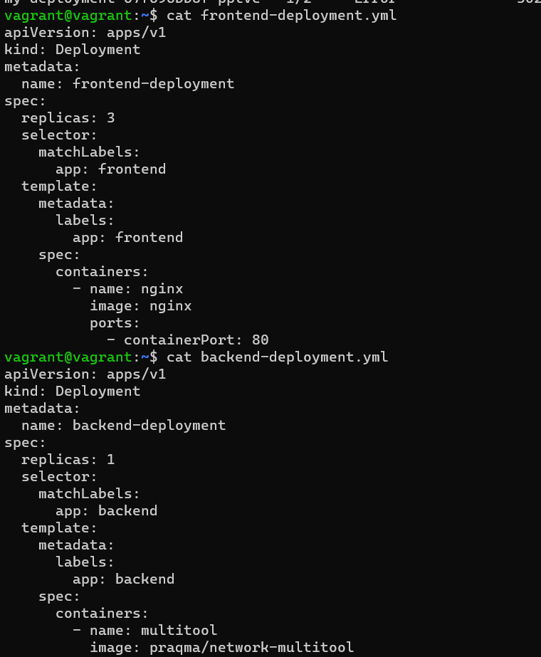
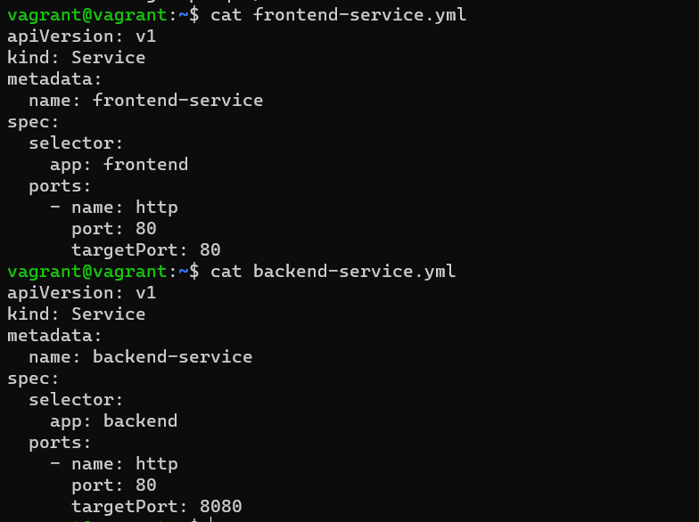
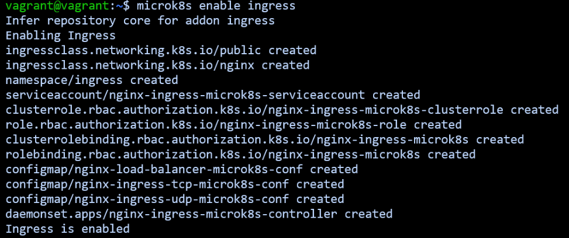
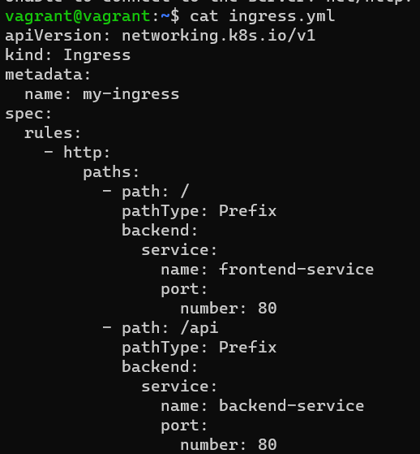

# Домашнее задание к занятию «Сетевое взаимодействие в K8S. Часть 2»

### Цель задания

В тестовой среде Kubernetes необходимо обеспечить доступ к двум приложениям снаружи кластера по разным путям.

------

### Чеклист готовности к домашнему заданию

1. Установленное k8s-решение (например, MicroK8S).
2. Установленный локальный kubectl.
3. Редактор YAML-файлов с подключённым Git-репозиторием.

------

### Инструменты и дополнительные материалы, которые пригодятся для выполнения задания

1. [Инструкция](https://microk8s.io/docs/getting-started) по установке MicroK8S.
2. [Описание](https://kubernetes.io/docs/concepts/services-networking/service/) Service.
3. [Описание](https://kubernetes.io/docs/concepts/services-networking/ingress/) Ingress.
4. [Описание](https://github.com/wbitt/Network-MultiTool) Multitool.

------

### Задание 1. Создать Deployment приложений backend и frontend

1. Создать Deployment приложения _frontend_ из образа nginx с количеством реплик 3 шт.
2. Создать Deployment приложения _backend_ из образа multitool. 
3. Добавить Service, которые обеспечат доступ к обоим приложениям внутри кластера. 
4. Продемонстрировать, что приложения видят друг друга с помощью Service.
5. Предоставить манифесты Deployment и Service в решении, а также скриншоты или вывод команды п.4.




```
vagrant@vagrant:~$ kubectl get service
NAME               TYPE        CLUSTER-IP       EXTERNAL-IP   PORT(S)    AGE
kubernetes         ClusterIP   10.152.183.1     <none>        443/TCP    7d13h
netology-svc       ClusterIP   10.152.183.142   <none>        8080/TCP   9h
my-service         ClusterIP   10.152.183.150   <none>        80/TCP     8h
backend-service    ClusterIP   10.152.183.230   <none>        80/TCP     2m
frontend-service   ClusterIP   10.152.183.158   <none>        80/TCP     3m
```
```
vagrant@vagrant:~$ kubectl get pods
NAME                                 READY   STATUS             RESTARTS       AGE
multitool                            1/1     Running            1 (20m ago)    7h12m
deployment1-5f69c9b6dd-dxj82         0/1     Running            1              7h
backend-deployment-732bb7587-956s6   1/1     Running            0              13m
frontend-deployment-fdd4d665-9fxh8   1/1     Running            0              13m
frontend-deployment-fdd4d665-2xwkk   1/1     Running            0              13m
frontend-deployment-fdd4d665-qt45q   1/1     Running            0              13m
```
```
vagrant@vagrant:~$ kubectl exec backend-deployment-732bb7587-956s6 -- curl be-svc
  % Total    % Received % Xferd  Average Speed   Time    Time     Time  Current
                                 Dload  Upload   Total   Spent    Left  Speed
100   612  100   612    0     0  15444      0 --:--:-- --:--:-- --:--:-- 15692
<!DOCTYPE html>
<html>
<head>
<title>Welcome to nginx!</title>
<style>
    body {
        width: 35em;
        margin: 0 auto;
        font-family: Tahoma, Verdana, Arial, sans-serif;
    }
</style>
</head>
<body>
<h1>Welcome to nginx!</h1>
<p>If you see this page, the nginx web server is successfully installed and
working. Further configuration is required.</p>

<p>For online documentation and support please refer to
<a href="http://nginx.org/">nginx.org</a>.<br/>
Commercial support is available at
<a href="http://nginx.com/">nginx.com</a>.</p>

<p><em>Thank you for using nginx.</em></p>
</body>
</html>
kubectl exec frontend-deployment-fdd4d665-9fxh8 -- curl be-svc
  % Total    % Received % Xferd  Average Speed   Time    Time     Time  Current
                                 Dload  Upload   Total   Spent    Left  Speed
100   141  100   141    0     0  15566      0 --:--:-- --:--:-- --:--:-- 15444
WBITT Network MultiTool (with NGINX) - backend-5596b5d66d-mqm4m - 10.1.128.243 - HTTP: 80 , HTTPS: 443 . (Formerly praqma/network-multitool)
```
------

### Задание 2. Создать Ingress и обеспечить доступ к приложениям снаружи кластера

1. Включить Ingress-controller в MicroK8S.
2. Создать Ingress, обеспечивающий доступ снаружи по IP-адресу кластера MicroK8S так, чтобы при запросе только по адресу открывался _frontend_ а при добавлении /api - _backend_.
3. Продемонстрировать доступ с помощью браузера или `curl` с локального компьютера.
4. Предоставить манифесты и скриншоты или вывод команды п.2.




```

vagrant@vagrant:~$ kubectl describe ingress
Name:             my-ingress
Labels:           <none>
Namespace:        default
Address:
Ingress Class:    public
Default backend:  <default>
Rules:
  Host        Path  Backends
  ----        ----  --------
  *
              /      frontend-service:80 (10.152.183.150:80,10.152.183.151:80,10.152.183.152:80)
              /api   backend-service:80 (10.152.183.230:8080)
Annotations:  <none>
Events:
  Type    Reason  Age                    From                      Message
  ----    ------  ----                   ----                      -------
  Normal  Sync    8m51s (x2 over 8m39s)  nginx-ingress-controller  Scheduled for sync
```

 ``` 
  vagrant@vagrant:~$ curl 192.168.192.11
<!DOCTYPE html>
<html>
<head>
<title>Welcome to nginx!</title>
<style>
    body {
        width: 35em;
        margin: 0 auto;
        font-family: Tahoma, Verdana, Arial, sans-serif;
    }
</style>
</head>
<body>
<h1>Welcome to nginx!</h1>
<p>If you see this page, the nginx web server is successfully installed and
working. Further configuration is required.</p>

<p>For online documentation and support please refer to
<a href="http://nginx.org/">nginx.org</a>.<br/>
Commercial support is available at
<a href="http://nginx.com/">nginx.com</a>.</p>
<p><em>Thank you for using nginx.</em></p>
</body>
</html>
```
```
vagrant@vagrant:~$ curl 192.168.192.11/api
% Total    % Received % Xferd  Average Speed   Time    Time     Time  Current
                                 Dload  Upload   Total   Spent    Left  Speed
100   141  100   141    0     0  15666      0 --:--:-- --:--:-- --:--:-- 15666
WBITT Network MultiTool (with NGINX) - backend-5596b5d66d-mqm4m - 10.1.128.243 - HTTP: 80 , HTTPS: 443 . (Formerly praqma/network-multitool)
```
------

### Правила приема работы

1. Домашняя работа оформляется в своем Git-репозитории в файле README.md. Выполненное домашнее задание пришлите ссылкой на .md-файл в вашем репозитории.
2. Файл README.md должен содержать скриншоты вывода необходимых команд `kubectl` и скриншоты результатов.
3. Репозиторий должен содержать тексты манифестов или ссылки на них в файле README.md.

------
