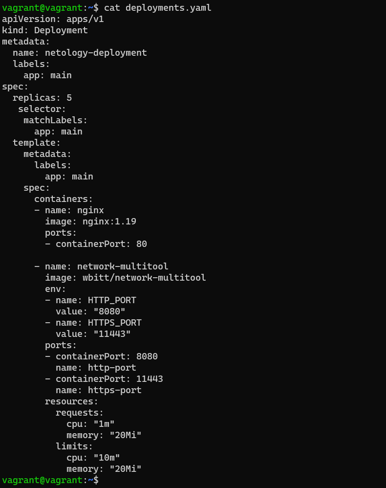
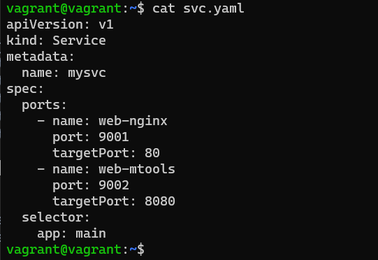
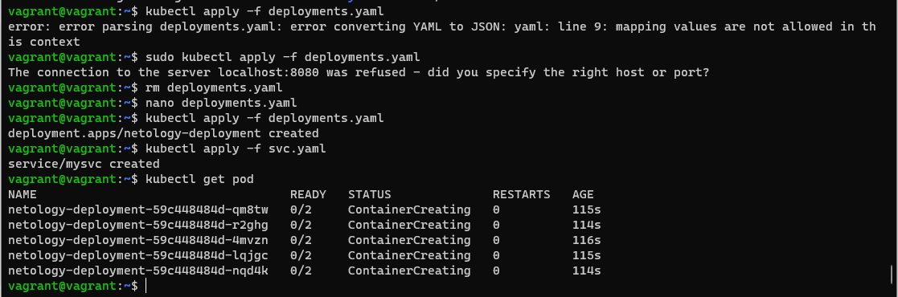
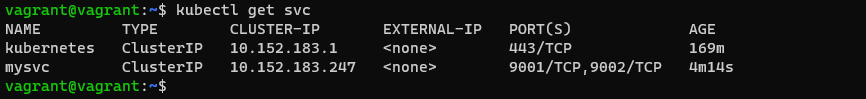
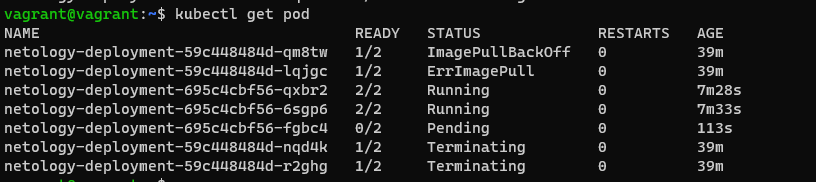

# Домашнее задание к занятию «Обновление приложений»

### Цель задания

Выбрать и настроить стратегию обновления приложения.

### Чеклист готовности к домашнему заданию

1. Кластер K8s.

### Инструменты и дополнительные материалы, которые пригодятся для выполнения задания

1. [Документация Updating a Deployment](https://kubernetes.io/docs/concepts/workloads/controllers/deployment/#updating-a-deployment).
2. [Статья про стратегии обновлений](https://habr.com/ru/companies/flant/articles/471620/).

-----

### Задание 1. Выбрать стратегию обновления приложения и описать ваш выбор

1. Имеется приложение, состоящее из нескольких реплик, которое требуется обновить.
2. Ресурсы, выделенные для приложения, ограничены, и нет возможности их увеличить.
3. Запас по ресурсам в менее загруженный момент времени составляет 20%.
4. Обновление мажорное, новые версии приложения не умеют работать со старыми.
5. Вам нужно объяснить свой выбор стратегии обновления приложения.

```html
Вариант 1. Если приложение уже протестировано ранее, то лучшим вариантом наверное будет использовать стратегию обновления
Rolling Update, указанием параметров maxSurge maxUnavailable для избежания ситуации с нехваткой ресурсов. Проводить обновление
следует естественно в менее загруженный момент времени сервиса. При данной стратегии(Rolling Update) k8s постепенно заменит 
все поды без ущерба производительности. И если что-то пойдет не так, можно будет быстро откатится к предыдущему состоянию.

Вариант 2. Можно использовать Canary Strategy. Также указав параметры maxSurge maxUnavailable чтобы избежать нехватки ресурсов.
Это позволит нам протестировать новую версию программы на реальной пользовательской базе(группа может выделяться по определенному
признаку) без обязательства полного развертывания. После тестирования и собирания метрик пользователей можно постепенно переводить
поды к новой версии приложения.
```

### Задание 2. Обновить приложение

1. Создать deployment приложения с контейнерами nginx и multitool. Версию nginx взять 1.19. Количество реплик — 5.
2. Обновить версию nginx в приложении до версии 1.20, сократив время обновления до минимума. Приложение должно быть доступно.
3. Попытаться обновить nginx до версии 1.28, приложение должно оставаться доступным.
4. Откатиться после неудачного обновления.


Решение:







```html
vagrant@vagrant:~$ kubectl get pod
NAME                                   READY   STATUS              RESTARTS   AGE
netology-deployment-59c448484d-r2ghg   2/2     Running             0          10m
netology-deployment-59c448484d-4mvzn   2/2     Running             0          10m
netology-deployment-59c448484d-lqjgc   2/2     Running             0          10m
netology-deployment-59c448484d-qm8tw   2/2     Running             0          10m
netology-deployment-59c448484d-nqd4k   2/2     Running             0          10m
vagrant@vagrant:~$ kubectl get pod netology-deployment-59c448484d-lqjgc -o yaml
apiVersion: v1
kind: Pod
metadata:
  annotations:
    cni.projectcalico.org/containerID: 21e7d8f8483b26bd5244d8388125dcec3e8b8cf9a4a892177a28984816498979
    cni.projectcalico.org/podIP: 10.1.52.140/32
    cni.projectcalico.org/podIPs: 10.1.52.140/32
  creationTimestamp: "2023-10-28T20:03:34Z"
  generateName: netology-deployment-59c448484d-
  labels:
    app: main
    pod-template-hash: 59c448484d
  name: netology-deployment-59c448484d-lqjgc
  namespace: default
  ownerReferences:
  - apiVersion: apps/v1
    blockOwnerDeletion: true
    controller: true
    kind: ReplicaSet
    name: netology-deployment-59c448484d
    uid: 6a86af08-e3bc-44f8-9f06-3b1b9d95eee0
  resourceVersion: "9340"
  uid: baff0ed4-41f2-4385-84e7-31438933b552
spec:
  containers:
  - image: nginx:1.19
    imagePullPolicy: IfNotPresent
    name: nginx
    ports:
    - containerPort: 80
      protocol: TCP
    resources: {}
    terminationMessagePath: /dev/termination-log
    terminationMessagePolicy: File
    volumeMounts:
    - mountPath: /var/run/secrets/kubernetes.io/serviceaccount
      name: kube-api-access-4lzf2
      readOnly: true
  - env:
    - name: HTTP_PORT
      value: "8080"
    - name: HTTPS_PORT
      value: "11443"
    image: wbitt/network-multitool
    imagePullPolicy: Always
    name: network-multitool
    ports:
    - containerPort: 8080
      name: http-port
      protocol: TCP
    - containerPort: 11443
      name: https-port
      protocol: TCP
    resources:
      limits:
        cpu: 10m
        memory: 20Mi
      requests:
        cpu: 1m
        memory: 20Mi
    terminationMessagePath: /dev/termination-log
    terminationMessagePolicy: File
    volumeMounts:
    - mountPath: /var/run/secrets/kubernetes.io/serviceaccount
      name: kube-api-access-4lzf2
      readOnly: true
  dnsPolicy: ClusterFirst
  enableServiceLinks: true
  nodeName: vagrant
  preemptionPolicy: PreemptLowerPriority
  priority: 0
  restartPolicy: Always
  schedulerName: default-scheduler
  securityContext: {}
  serviceAccount: default
  serviceAccountName: default
  terminationGracePeriodSeconds: 30
  tolerations:
  - effect: NoExecute
    key: node.kubernetes.io/not-ready
    operator: Exists
    tolerationSeconds: 300
  - effect: NoExecute
    key: node.kubernetes.io/unreachable
    operator: Exists
    tolerationSeconds: 300
  volumes:
  - name: kube-api-access-4lzf2
    projected:
      defaultMode: 420
      sources:
      - serviceAccountToken:
          expirationSeconds: 3607
          path: token
      - configMap:
          items:
          - key: ca.crt
            path: ca.crt
          name: kube-root-ca.crt
      - downwardAPI:
          items:
          - fieldRef:
              apiVersion: v1
              fieldPath: metadata.namespace
            path: namespace
status:
  conditions:
  - lastProbeTime: null
    lastTransitionTime: "2023-10-28T20:05:10Z"
    status: "True"
    type: Initialized
  - lastProbeTime: null
    lastTransitionTime: "2023-10-28T20:05:10Z"
    message: 'containers with unready status: [nginx]'
    reason: ContainersNotReady
    status: "False"
    type: Ready
  - lastProbeTime: null
    lastTransitionTime: "2023-10-28T20:05:10Z"
    message: 'containers with unready status: [nginx]'
    reason: ContainersNotReady
    status: "False"
    type: ContainersReady
  - lastProbeTime: null
    lastTransitionTime: "2023-10-28T20:03:35Z"
    status: "True"
    type: PodScheduled
  containerStatuses:
  - containerID: containerd://09a0d06f7e73653a02335d299d73e5052a923c9f01218dbd6737fd6cd9eea490
    image: docker.io/wbitt/network-multitool:latest
    imageID: docker.io/wbitt/network-multitool@sha256:d1137e87af76ee15cd0b3d4c7e2fcd111ffbd510ccd0af076fc98dddfc50a735
    lastState: {}
    name: network-multitool
    ready: true
    restartCount: 0
    started: true
    state:
      running:
        startedAt: "2023-10-28T20:07:39Z"
  - image: nginx:1.19
    imageID: ""
    lastState: {}
    name: nginx
    ready: false
    restartCount: 0
    started: false
    state:
      waiting:
        reason: ContainerCreating
  hostIP: 10.0.2.15
  phase: Pending
  podIP: 10.1.52.140
  podIPs:
  - ip: 10.1.52.140
  qosClass: Burstable
  startTime: "2023-10-28T20:05:10Z"
```

```html
vagrant@vagrant:~$ kubectl exec deployment/netology-deployment -- curl mysvc:9002
Defaulted container "nginx" out of: nginx, network-multitool
  % Total    % Received % Xferd  Average Speed   Time    Time     Time  Current
                                 Dload  Upload   Total   Spent    Left  Speed
100   156  100   156    0     0    129      0  0:00:01  0:00:01 --:--:--   130
WBITT Network MultiTool (with NGINX) - netology-deployment-59c448484d-nqd4k - 10.1.52.139 - HTTP: 8080 , HTTPS: 11443 . (Formerly praqma/network-multitool)
vagrant@vagrant:~$ kubectl apply -f deployments.yaml
deployment.apps/netology-deployment configured
vagrant@vagrant:~$ kubectl get pod -o wide
NAME                                   READY   STATUS             RESTARTS   AGE   IP            NODE      NOMINATED NODE   READINESS GATES
netology-deployment-59c448484d-nqd4k   2/2     Running            0          17m   10.1.52.139   vagrant   <none>           <none>
netology-deployment-59c448484d-4mvzn   2/2     Running            0          17m   10.1.52.142   vagrant   <none>           <none>
netology-deployment-59c448484d-lqjgc   2/2     Running            0          17m   10.1.52.140   vagrant   <none>           <none>
netology-deployment-59c448484d-r2ghg   2/2     Running            0          17m   10.1.52.144   vagrant   <none>           <none>
netology-deployment-59c448484d-qm8tw   2/2     Running            0          17m   10.1.52.143   vagrant   <none>           <none>
vagrant@vagrant:~$ kubectl exec deployment/netology-deployment -- curl mysvc:9002
Defaulted container "nginx" out of: nginx, network-multitool
  % Total    % Received % Xferd  Average Speed   Time    Time     Time  Current
                                 Dload  Upload   Total   Spent    Left  Speed
  0     0    0     0    0     0      0      0 --:--:-- --:--:-- --:--:--     0WBITT Network MultiTool (with NGINX) - netology-deployment-59c448484d-qm8tw - 10.1.52.143 - HTTP: 8080 , HTTPS: 11443 . (Formerly praqma/network-multitool)
100   156  100   156    0     0    157      0 --:--:-- --:--:-- --:--:--   156



vagrant@vagrant:~$ kubectl describe deployment netology-deployment
Name:                   netology-deployment
Namespace:              default
CreationTimestamp:      Sat, 28 Oct 2023 20:03:30 +0000
Labels:                 app=main
Annotations:            deployment.kubernetes.io/revision: 2
Selector:               app=main
Replicas:               5 desired | 5 updated | 5 total | 5 available | 0 unavailable
StrategyType:           RollingUpdate
MinReadySeconds:        0
RollingUpdateStrategy:  1 max unavailable, 1 max surge
Pod Template:
  Labels:  app=main
  Containers:
   nginx:
    Image:        nginx:1.20
    Port:         80/TCP
    Host Port:    0/TCP
    Environment:  <none>
    Mounts:       <none>
   network-multitool:
    Image:       wbitt/network-multitool
    Ports:       8080/TCP, 11443/TCP
    Host Ports:  0/TCP, 0/TCP
    Limits:
      cpu:     10m
      memory:  20Mi
    Requests:
      cpu:     1m
      memory:  20Mi
    Environment:
      HTTP_PORT:   8080
      HTTPS_PORT:  11443
    Mounts:        <none>
  Volumes:         <none>
Conditions:
  Type           Status  Reason
  ----           ------  ------
  Available      True    MinimumReplicasUnavailable
  Progressing    True    ReplicaSetUpdated
OldReplicaSets:  netology-deployment-59c448484d (5/5 replicas created) 
NewReplicaSet:   netology-deployment-695c4cbf56 (5/5 replicas created)
Events:         
Type    Reason             Age    From                   Message
  ----    ------             ----   ----                   -------
  Normal  ScalingReplicaSet  3m54s  deployment-controller  Scaled down replica set netology-deployment-59c448484d to 2 from 4
  Normal  ScalingReplicaSet  3m53s  deployment-controller  Scaled up replica set netology-deployment-695c4cbf56 to 4 from 2
  Normal  ScalingReplicaSet  2m37s  deployment-controller  Scaled down replica set netology-deployment-59c448484d to 1 from 2
  Normal  ScalingReplicaSet  2m37s  deployment-controller  Scaled up replica set netology-deployment-695c4cbf56 to 5 from 4
  Normal  ScalingReplicaSet  2m10s  deployment-controller  Scaled down replica set netology-deployment-59c448484d to 0 from 1
vagrant@vagrant:~$
```
 ```
 vagrant@vagrant:~$ kubectl exec deployment/netology-deployment -- curl mysvc:9002
Defaulted container "nginx" out of: nginx, network-multitool
  % Total    % Received % Xferd  Average Speed   Time    Time     Time  Current
                                 Dload  Upload   Total   Spent    Left  Speed
100   156  100   156    0     0    129      0  0:00:01  0:00:01 --:--:--   130
WBITT Network MultiTool (with NGINX) - netology-deployment-59c448484d-nqd4k - 10.1.52.139 - HTTP: 8080 , HTTPS: 11443 . (Formerly praqma/network-multitool)
vagrant@vagrant:~$ kubectl apply -f deployments.yaml
deployment.apps/netology-deployment configured
vagrant@vagrant:~$ kubectl get pod -o wide
NAME                                   READY   STATUS             RESTARTS   AGE   IP            NODE      NOMINATED NODE   READINESS GATES
netology-deployment-59c448484d-nqd4k   2/2     Running            0          17m   10.1.52.139   vagrant   <none>           <none>
netology-deployment-59c448484d-4mvzn   2/2     Running            0          17m   10.1.52.142   vagrant   <none>           <none>
netology-deployment-59c448484d-lqjgc   2/2     Running            0          17m   10.1.52.140   vagrant   <none>           <none>
netology-deployment-59c448484d-r2ghg   2/2     Running            0          17m   10.1.52.144   vagrant   <none>           <none>
netology-deployment-59c448484d-qm8tw   2/2     Running            0          17m   10.1.52.143   vagrant   <none>           <none>
vagrant@vagrant:~$ kubectl exec deployment/netology-deployment -- curl mysvc:9002
Defaulted container "nginx" out of: nginx, network-multitool
  % Total    % Received % Xferd  Average Speed   Time    Time     Time  Current
                                 Dload  Upload   Total   Spent    Left  Speed
  0     0    0     0    0     0      0      0 --:--:-- --:--:-- --:--:--     0WBITT Network MultiTool (with NGINX) - netology-deployment-59c448484d-qm8tw - 10.1.52.143 - HTTP: 8080 , HTTPS: 11443 . (Formerly praqma/network-multitool)
100   156  100   156    0     0    157      0 --:--:-- --:--:-- --:--:--   156


vagrant@vagrant:~$ kubectl describe deployment netology-deployment
Name:                   netology-deployment
Namespace:              default
CreationTimestamp:      Sat, 28 Oct 2023 20:03:30 +0000
Labels:                 app=main
Annotations:            deployment.kubernetes.io/revision: 2
Selector:               app=main
Replicas:               5 desired | 5 updated | 5 total | 5 available | 0 unavailable
StrategyType:           RollingUpdate
MinReadySeconds:        0
RollingUpdateStrategy:  1 max unavailable, 1 max surge
Pod Template:
  Labels:  app=main
  Containers:
   nginx:
    Image:        nginx:1.20
    Port:         80/TCP
    Host Port:    0/TCP
    Environment:  <none>
    Mounts:       <none>
   network-multitool:
    Image:       wbitt/network-multitool
    Ports:       8080/TCP, 11443/TCP
    Host Ports:  0/TCP, 0/TCP
    Limits:
      cpu:     10m
      memory:  20Mi
    Requests:
      cpu:     1m
      memory:  20Mi
    Environment:
      HTTP_PORT:   8080
      HTTPS_PORT:  11443
    Mounts:        <none>
  Volumes:         <none>
Conditions:
  Type           Status  Reason
  ----           ------  ------
  Available      True    MinimumReplicasUnavailable
  Progressing    True    ReplicaSetUpdated
OldReplicaSets:  netology-deployment-59c448484d (5/5 replicas created) 
NewReplicaSet:   netology-deployment-695c4cbf56 (5/5 replicas created)
Events:         
Type    Reason             Age    From                   Message
  ----    ------             ----   ----                   -------
  Normal  ScalingReplicaSet  3m54s  deployment-controller  Scaled down replica set netology-deployment-59c448484d to 2 from 4
  Normal  ScalingReplicaSet  3m53s  deployment-controller  Scaled up replica set netology-deployment-695c4cbf56 to 4 from 2
  Normal  ScalingReplicaSet  2m37s  deployment-controller  Scaled down replica set netology-deployment-59c448484d to 1 from 2
  Normal  ScalingReplicaSet  2m37s  deployment-controller  Scaled up replica set netology-deployment-695c4cbf56 to 5 from 4
  Normal  ScalingReplicaSet  2m10s  deployment-controller  Scaled down replica set netology-deployment-59c448484d to 0 from 1

Обновляем до 1.28:

vagrant@vagrant:~$ kubectl apply -f deployments.yaml
deployment.apps/netology-deployment configured
vagrant@vagrant:~$ kubectl get pod
NAME                                   READY   STATUS             RESTARTS   AGE
nginx-77b4fdf86c-7jtmk                 1/1     Running            0          67m
netology-deployment-695c4cbf56-xrfbp   2/2     Running            0          15m
netology-deployment-695c4cbf56-dmqs5   2/2     Running            0          15m
netology-deployment-695c4cbf56-b9ts4   2/2     Running            0          11m
netology-deployment-695c4cbf56-hwvch   2/2     Running            0          10m
netology-deployment-59c448484d-2p45n   1/2     ImagePullBackOff   0          4m19s
netology-deployment-59c448484d-j8249   1/2     ImagePullBackOff   0          4m12s
vagrant@vagrant:~$ kubectl exec deployment/netology-deployment -- curl mysvc:9002
Defaulted container "nginx" out of: nginx, network-multitool
  % Total    % Received % Xferd  Average Speed   Time    Time     Time  Current
                                 Dload  Upload   Total   Spent    Left  Speed
  0     0    0     0    0     0      0      0 --:--:-- --:--:-- --:--:--     0WBITT Network MultiTool (with NGINX) - netology-deployment-695c4cbf56-b9ts4 - 10.1.52.142 - HTTP: 8080 , HTTPS: 11443 . (Formerly praqma/network-multitool)
100   156  100   156    0     0    684      0 --:--:-- --:--:-- --:--:--   687


Обновление не прошло, откатываем назад: 

vagrant@vagrant:~$ kubectl rollout status deployment netology-deployment
I1018 09:49:02.520555  236920 trace.go:219] Trace[473949813]: "Reflector ListAndWatch" name:vendor/k8s.io/client-go/tools/watch/informerwatcher.go:146 (28-Oct-2023 20:48:47.475) (total time: 14877ms):
Trace[473949813]: ---"Objects listed" error:<nil> 14832ms (20:49:02.308)
Trace[473949813]: [14.877111316s] [14.877111316s] END
Waiting for deployment "netology-deployment" rollout to finish: 2 out of 5 new replicas have been updated...


vagrant@vagrant:~$ kubectl rollout status deployment netology-deployment
deployment.apps/netology-deployment rolled back
vagrant@vagrant:~$ kubectl get pod
NAME                                   READY   STATUS             RESTARTS   AGE
nginx-77b4fdf86c-7jtmk                 1/1     Running            0          77m
netology-deployment-695c4cbf56-xrfbp   2/2     Running            0          25m
netology-deployment-695c4cbf56-dmqs5   2/2     Running            0          25m
netology-deployment-695c4cbf56-b9ts4   2/2     Running            0          21m
netology-deployment-695c4cbf56-hwvch   2/2     Running            0          20m
netology-deployment-59c448484d-2p45n   2/2     Running            0          19s
netology-deployment-59c448484d-j8249   2/2     Running            0          12s

```
 


## Дополнительные задания — со звёздочкой*

Задания дополнительные, необязательные к выполнению, они не повлияют на получение зачёта по домашнему заданию. **Но мы настоятельно рекомендуем вам выполнять все задания со звёздочкой.** Это поможет лучше разобраться в материале.   

### Задание 3*. Создать Canary deployment

1. Создать два deployment'а приложения nginx.
2. При помощи разных ConfigMap сделать две версии приложения — веб-страницы.
3. С помощью ingress создать канареечный деплоймент, чтобы можно было часть трафика перебросить на разные версии приложения.

### Правила приёма работы

1. Домашняя работа оформляется в своем Git-репозитории в файле README.md. Выполненное домашнее задание пришлите ссылкой на .md-файл в вашем репозитории.
2. Файл README.md должен содержать скриншоты вывода необходимых команд, а также скриншоты результатов.
3. Репозиторий должен содержать тексты манифестов или ссылки на них в файле README.md.
